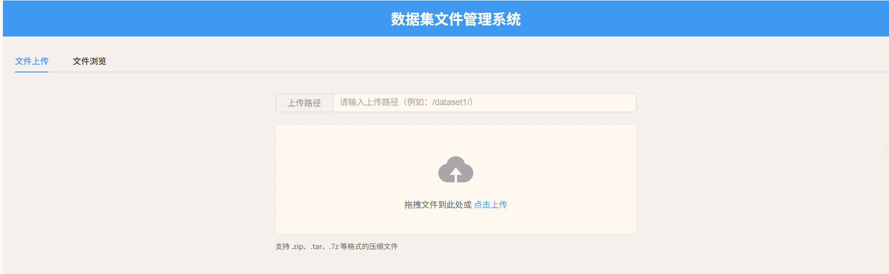
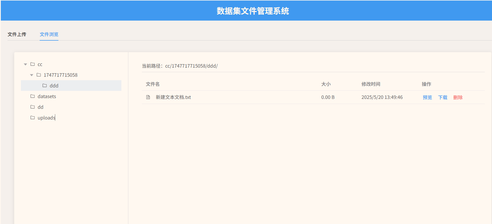

# 数据集文件管理系统

基于 Vue 3 + Spring Boot + MinIO 实现的数据集文件管理系统。

## 界面参考



## 功能特点

- 支持文件上传（包括分片上传）
- 支持压缩包自动解压
- 文件目录树展示
- 文件列表查看
- 文件下载
- 文件删除

## 技术栈

### 前端
- Vue 3
- Element Plus
- Axios
- Vite

### 后端
- Spring Boot 2.x
- MinIO Java SDK
- Maven

### 存储
- MinIO

## 快速开始

### 1. 启动 MinIO

```bash
docker run -d \
  -p 9000:9000 \
  -p 9001:9001 \
  -e "MINIO_ROOT_USER=minioadmin" \
  -e "MINIO_ROOT_PASSWORD=minioadmin" \
  -v /path/to/data:/data \
  minio/minio server /data --console-address ":9001"
```

### 2. 启动后端服务

```bash
cd backend
mvn spring-boot:run
```

### 3. 启动前端服务

```bash
cd frontend
npm install
npm run dev
```

## 配置说明

### MinIO 配置

在 `backend/src/main/resources/application.yml` 中配置 MinIO 连接信息：

```yaml
minio:
  endpoint: http://localhost:9000
  accessKey: minioadmin
  secretKey: minioadmin
  bucket: datasets
```

### 前端配置

在 `frontend/vite.config.js` 中配置开发服务器代理：

```javascript
server: {
  proxy: {
    '/api': {
      target: 'http://localhost:8080',
      changeOrigin: true
    }
  }
}
```

## 使用说明

1. 访问 http://localhost:3000 打开应用
2. 在"文件上传"标签页上传文件
3. 在"文件浏览"标签页查看和管理文件

## 注意事项

- 确保 MinIO 服务已正确启动
- 确保后端服务端口（8080）未被占用
- 确保前端服务端口（3000）未被占用
- 上传大文件时建议使用分片上传功能 